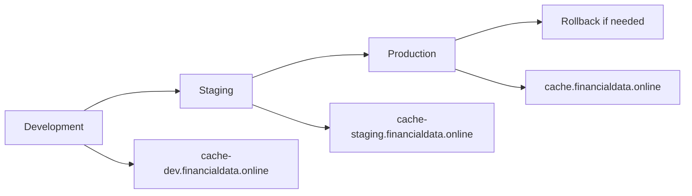

# Worker Versioning Implementation Summary

## 🚀 What's Been Implemented

Your Cloudflare Worker now has **enterprise-grade versioning** with:

### **✅ Multiple Environments**
- **Development**: `financialdata-cache-worker-dev`
- **Staging**: `financialdata-cache-worker-staging`  
- **Production**: `financialdata-cache-worker-production`

### **✅ Configuration Files**
- `wrangler.dev.jsonc` - Development environment
- `wrangler.staging.jsonc` - Staging environment
- `wrangler.production.jsonc` - Production environment

### **✅ Deployment Scripts**
- `deploy-versioned.sh` - Advanced deployment with versioning
- `rollback.sh` - Quick rollback to previous versions
- `package.json` scripts for easy deployment

### **✅ Version Tracking**
- Enhanced health endpoint with version info
- Version headers on all responses
- Git integration with automatic tagging

## 🎯 Quick Commands

### **Deploy to Environments**
```bash
# Development
npm run deploy:dev

# Staging  
npm run deploy:staging

# Production
npm run deploy:production

# Production with auto-versioning
npm run deploy:version
```

### **Advanced Deployment**
```bash
# Deploy with specific version
./deploy-versioned.sh -e production -v v1.2.3 -m "Bug fix release"

# Auto-generate version from git
./deploy-versioned.sh -e staging -a

# Deploy development build
./deploy-versioned.sh -e dev
```

### **Rollback**
```bash
# List available versions
./rollback.sh -l

# Rollback production
./rollback.sh -e production -v v1.0.0

# Rollback with confirmation
./rollback.sh -e production -v v1.1.0
```

## 📊 Version Information

### **Health Endpoint Response**
```json
{
  "status": "ok",
  "version": "v1.0.0",
  "environment": "production", 
  "timestamp": "2024-12-01T15:30:00.000Z",
  "backend": "https://api.financialdata.online"
}
```

### **Response Headers**
```
x-worker-version: v1.0.0
x-worker-environment: production
```

## 🔄 Deployment Flow



## 🏷️ Version Examples

### **Production Versions**
- `v1.0.0` - Initial release
- `v1.1.0` - Feature release
- `v1.1.1` - Patch release
- `v2.0.0` - Major release

### **Staging Versions**
- `staging-20241201-1430-abc123`
- `staging-20241201-1445-def456`

### **Development Versions**
- `dev-main-abc123`
- `dev-feature-xyz-def456`

## 🎯 Benefits

### **🔐 Safety**
- Environment isolation prevents accidents
- Production rollback capability
- Confirmation prompts for critical operations

### **📈 Scalability**
- Multiple environment support
- Git integration and tagging
- CI/CD pipeline ready

### **🔍 Observability**
- Version tracking on every request
- Health endpoint monitoring
- Full deployment audit trail

### **🚀 Speed**
- One-command deployments
- Auto-versioning capability
- Quick rollback in emergencies

## 📋 Next Steps to Deploy

1. **Add Account/Zone IDs** to config files
2. **Authenticate Wrangler**: `npx wrangler login`
3. **Deploy Development**: `npm run deploy:dev`
4. **Test & Deploy Staging**: `npm run deploy:staging`
5. **Deploy Production**: `npm run deploy:production`

## 🔧 Configuration Required

Update each environment config with your Cloudflare IDs:

```json
{
  "account_id": "YOUR_ACCOUNT_ID_HERE",
  "routes": [
    {
      "pattern": "cache.financialdata.online/*",
      "zone_id": "YOUR_ZONE_ID_HERE"
    }
  ]
}
```

Your worker is now ready for **enterprise-grade deployment** with full version control! 🎉